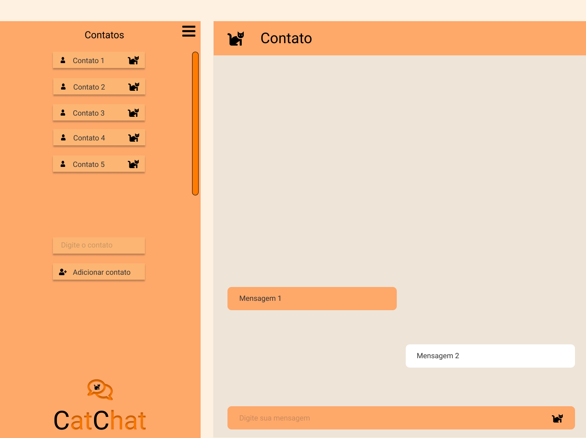
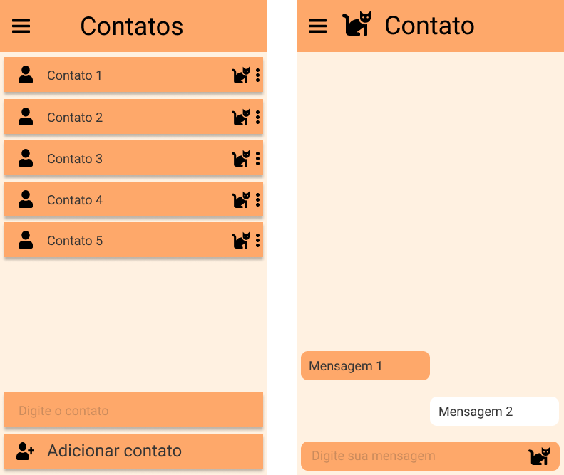
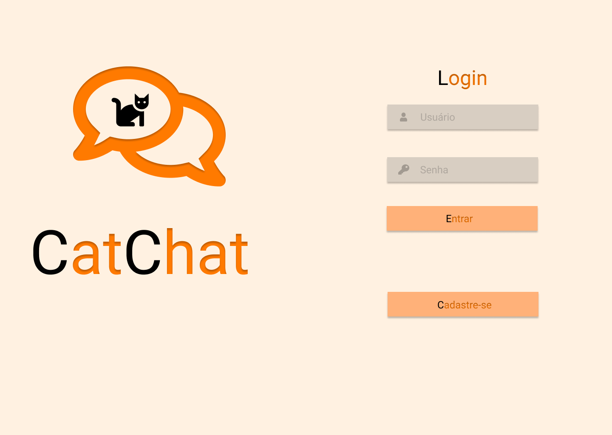
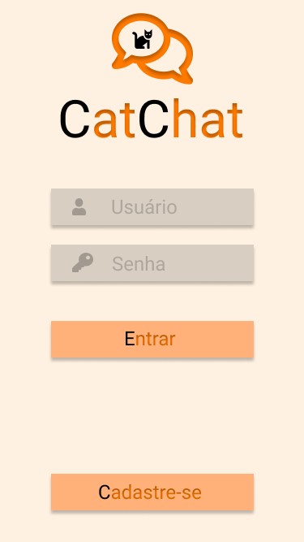
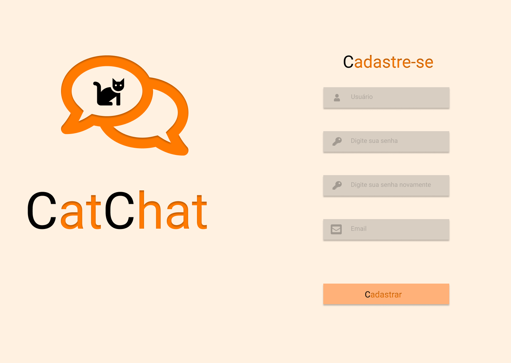
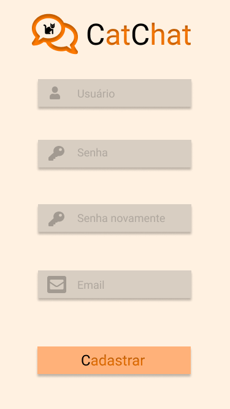

# CatChat

Web chat para disciplina INE5646 - Programação para Web.

## Motivação do projeto e Funcionalidades principais

### Solução geral

O projeto trata-se de um web chat. Nesse sistema web os usuários poderão se cadastrar, realizar login, adicionar contatos de outros usuários, conversar com seus contatos, etc -- as atividades serão vistas em mais detalhes na seção de Atividades principais.  
As principais motivações para a escolha desse tema foram a capacidade de utilizar todas as tecnologias aprendidas em sala de aula e outras as quais o grupo considera que tem um bom conhecimento para realizar um trabalho interessante -- como, por exemplo, HTML, CSS, Javascript, SQL, Java, etc.  
Outro motivo que interessou o grupo a realizar essa escolha foi o fato de ser um sistema onde os usuários interagem uns com os outros, tendo uma dinâmica interessante.  

### Atividades principais

Pode-se enumerar as atividades principais da seguinte forma:  

* Cadastro de usuário

    Nesta atividade será possível que o usuário que não possui cadastro no sistema crie um preenchendo um formulário com informações a serem estabelecidas, como nome de usuário, senha, email, etc. Feito isso, tem-se o usuário salvo na base de dados do sistema e o usuário será redirecionado à página de login. A maioria dos dados serão salvos como foram preenchidos, porém a senha do usuário não será salva em texto plano e sim seu hash criptográfico.  

* Login de usuário

    Nesta atividade será possível que o usuário que já possui cadastro no sistema preencha um formulário com seu nome de usuário e sua senha para entrar no sistema. Caso o usuário preencha a tupla nome de usuário e senha corretamente, ele será redirecionado à página principal do sistema. Caso contrário o usuário poderá tentar novamente -- talvez seja implementada uma política de número máximo de tentativas num curto período de tempo que caso não sejam corretas o usuário receba um timeout para tentar só após um certo período.

* Adicionar contato

    Nesta atividade o usuário poderá adicionar outros usuários aos seus contatos. Isso será feito com uma aba na tela principal, não sendo necessário uma página separada apenas para isso. Para adicionar um contato, o usuário deverá preencher um formulário com o nome do usuário a ser adicionado e clicar no botão de adicionar usuário. Caso o nome exista o usuário será adicionado, caso contrário não será -- com uma mensagem informando que obteve ou não sucesso.

* Remover contato

    Nesta atividade o usuário poderá remover um contato que já adicionou a sua lista de contatos. Para isso, ele poderá abrir uma aba (a mesma da atividade anterior de Adicionar contato) e selecionar um contato para removê-lo. Após isso, basta clicar no botão de remover usuário e o usuário será removido.

* Conversar com contato

    Nesta atividade o usuário poderá conversar com um contato que já adicionou a sua lista de contatos. Para isso, ele poderá abrir uma aba (a mesma das atividades anteriores de Adicionar contato e Remover contato) e clicar no contato que deseja conversar. Após isso, irá abrir um chat com o contato. No chat os usuários poderão trocar mensagens simples de texto. As mensagens serão salvas no banco de dados do sistema, dessa forma, não importa de qual dispositivo o usuário entre no sistema suas conversas sempre estarão salvas.

### Diferencial da proposta

Nosso diferencial está na segurança dos usuários, não há preocupações quanto a roubo de informações e perda de contas. Além disso, temos um ambiente de fácil acesso em qualquer dispositivo, até os mais antigos e os amantes de gatos vão amar nossa interface. Também não há necessidade de instalar nada e muito menos de precisar deixar o celular conectado enquanto usa o chat em outro aparelho.

### Público alvo

O nosso público alvo é qualquer pessoa com um dispositivo de tela com acesso a internet que queira trocar mensagens com alguém distante de forma prática. Também temos um toque especial para os amantes de gato, dá uma olhada na nossa interface!

### Protótipos

#### Tela Principal

* Desktop

* Mobile

#### Tela Login

* Desktop

* Mobile

#### Tela Cadastro

* Desktop

* Mobile

